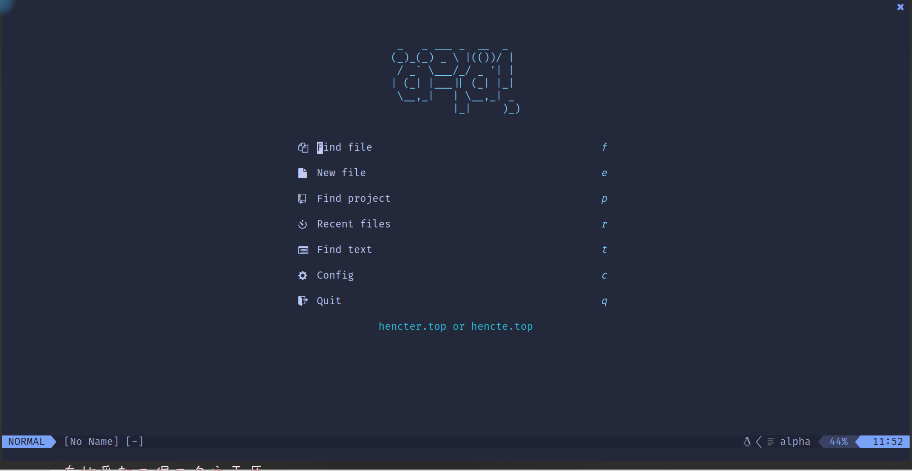

# 亦幸的 Neovim 配置

## 安装 Neovim 0.7

```sh
git clone https://github.com/neovim/neovim.git
cd neovim
git checkout release-0.8
make CMAKE_BUILD_TYPE=Release
sudo make install
```

## 安装配置

```sh
git clone git@github.com:hencter/nvim.git ~/.config/nvim
```

## 查看 Neovim 健康状况

[`:checkhealth`]("https://neovim.io/doc/user/pi_health.html#:checkhealth")

### 一些依赖

==补充==

如果你像我一样使用 Arch Linux 请提前安装 Packer, 当然它在 ArchLinux CN 源

```bash
# 包管理器,虽然可以里面有脚本可以安装,但是提前安装可以加快安装插件进度
sudo pacman -S archlinuxcn/nvim-packer-git
# 剪贴内容到系统剪贴板
sudo pacman -S extra/xclip
```

## 插件

## 参考资料

- <https://github.com/nanotee/nvim-lua-guide>
- <https://github.com/glepnir/nvim-lua-guide-zh>
- <https://github.com/rockerBOO/awesome-neovim>
- <https://github.com/LunarVim/nvim-basic-ide>

## 展示


